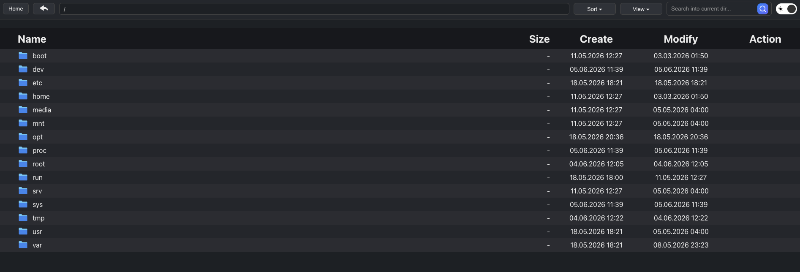
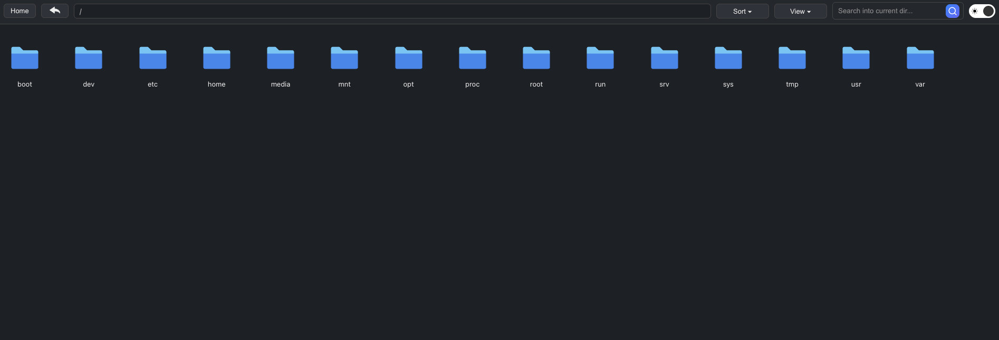

# file-explorer
Бібліотека, яка дозволяє створити в проєкті сторінку для перегляду файлів і тек по аналогії з файловим менеджером операційної системи. Може відображати вміст будь-якого шляху проєкту.

У проєкті реалізовано:
1. Можливість встановлення теми світлої або темної.
2. Приховування файлів та тек по іменах.
3. Відображення файлів за розширенням.
4. Сортування за іменем, розміром та датою останнього змінення.
5. Перегляд у табличному або плиточному вигляді.
6. Пошук по поточній директорії.
7. Швидке повернення на початок, на попередню директорію, перехід по хлібним крихтам.

### Приклад використання

```
echo (new YouriyPaluch\FileExplorer\Dispatcher(
PROJECT_ROOT . '/logs',
'show-logs',
['txt', 'log'],
['.gitignore''],
))->showContent();
```



